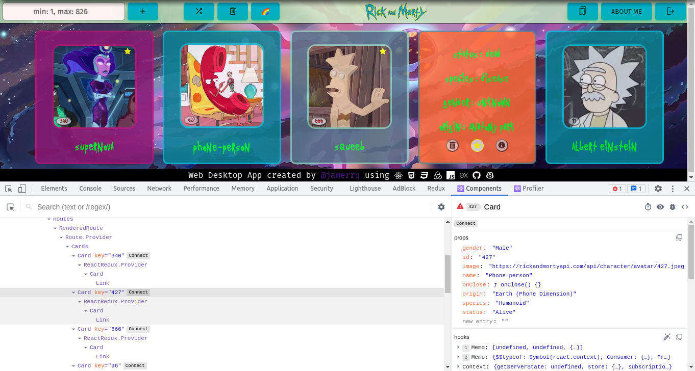

# Rick And Morty App (Full Stack Version)

Versión full stack de esta [app](https://github.com/jamerrq/rickAndMorty)
desarrollada en React.

## Setup

## Desktop App

## Tests

## Features

### Log In and Log Out

### Search by ID

### Add random character, Clear all characters

### Favorites

### About me section

## React Components

## Redux

## My PC Specs

